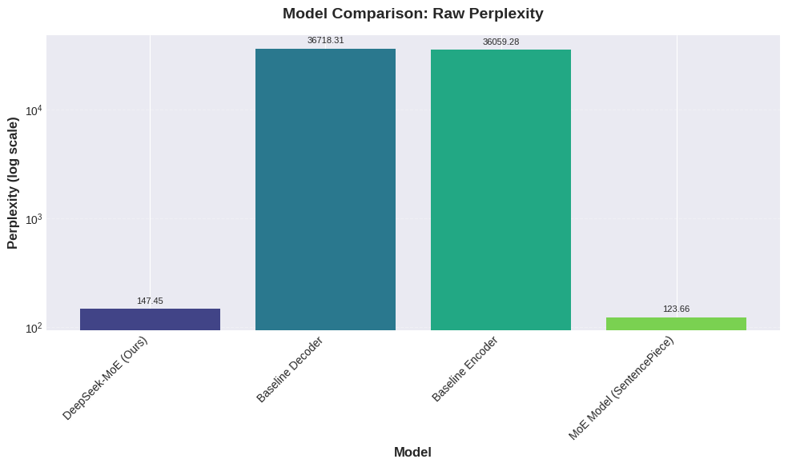
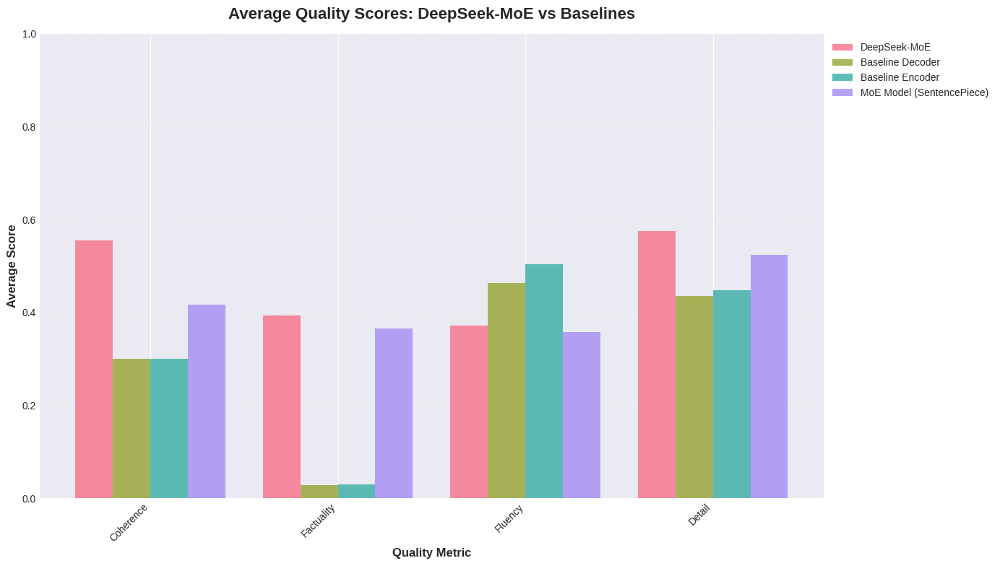
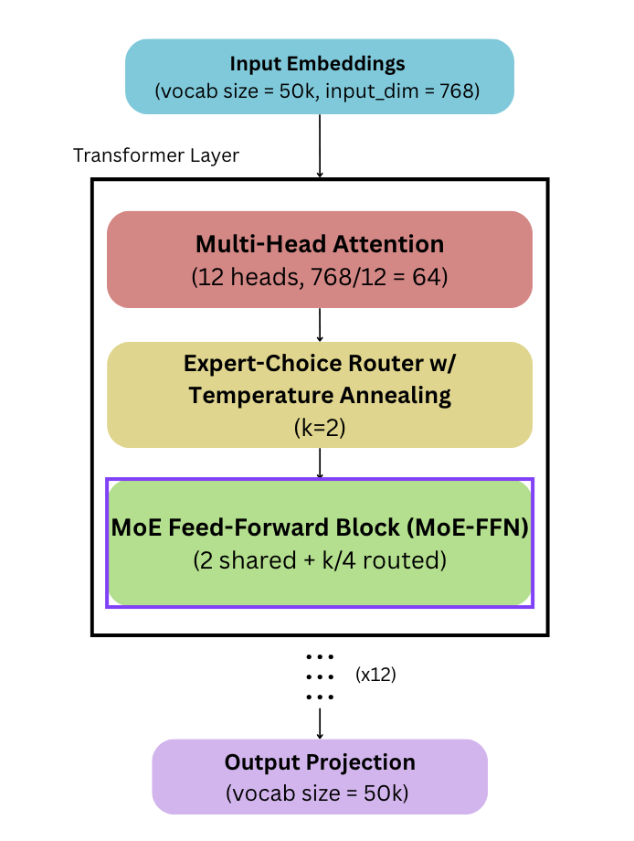
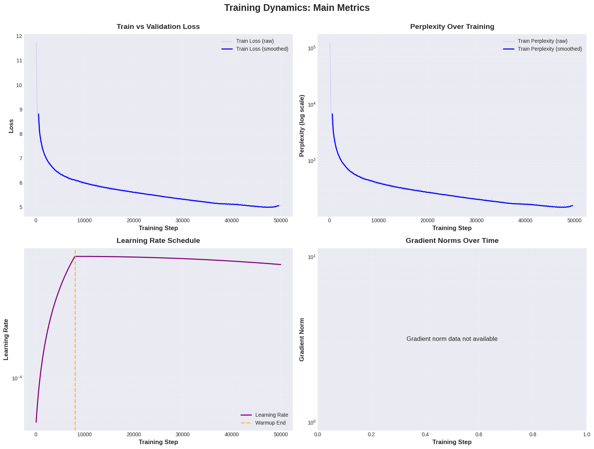
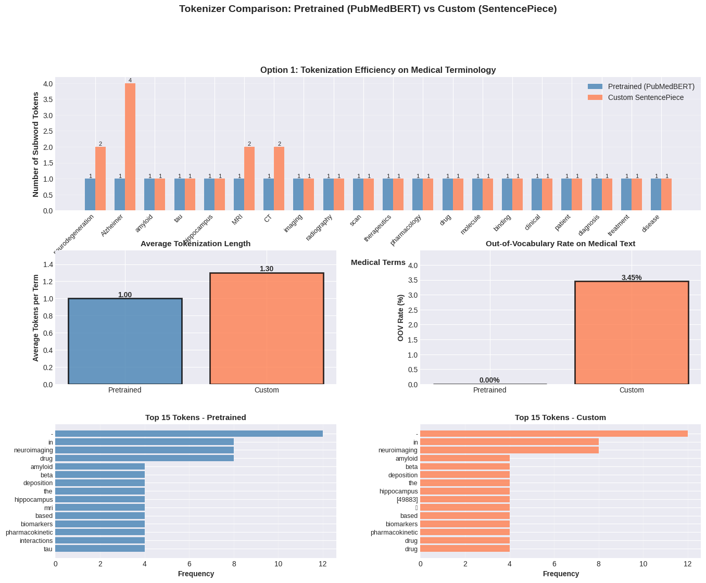
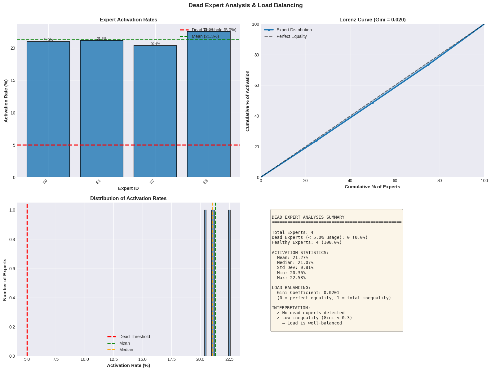
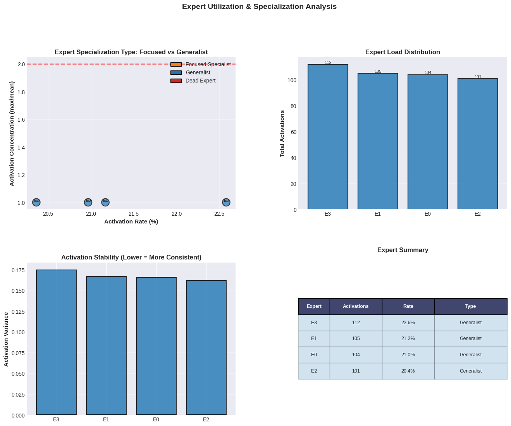
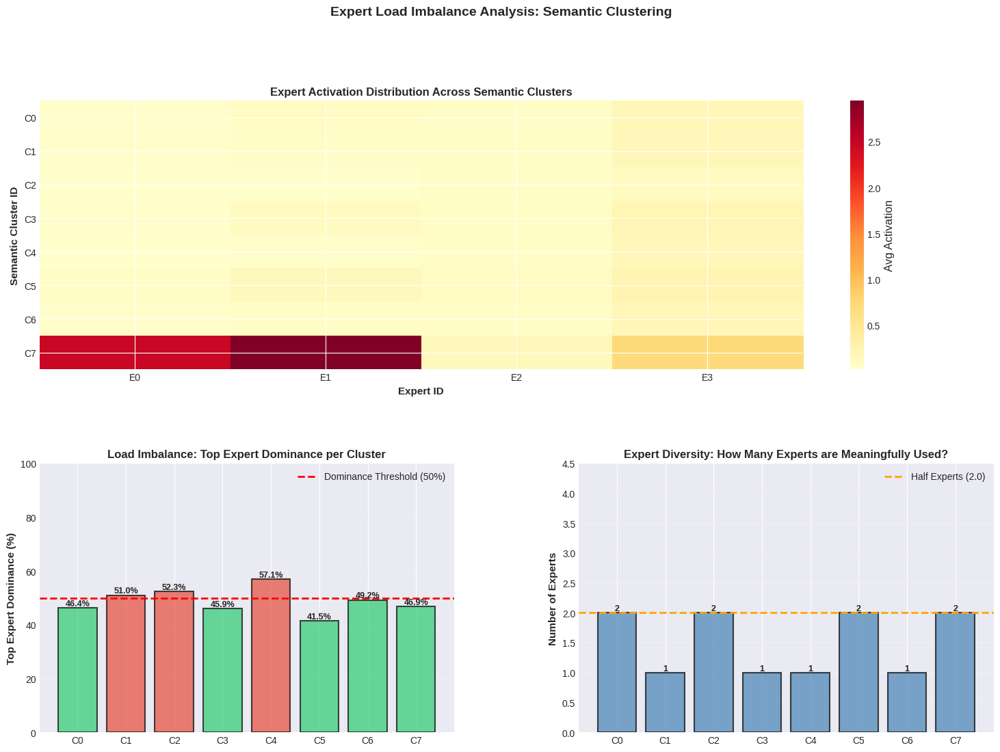
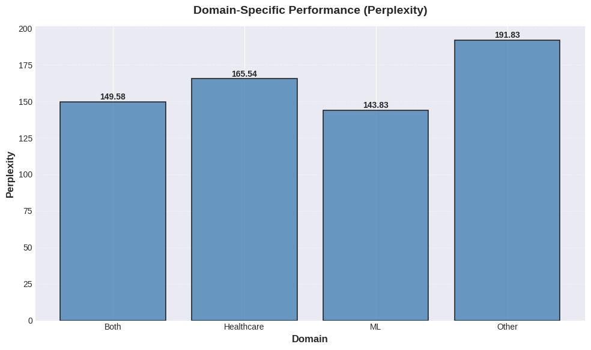
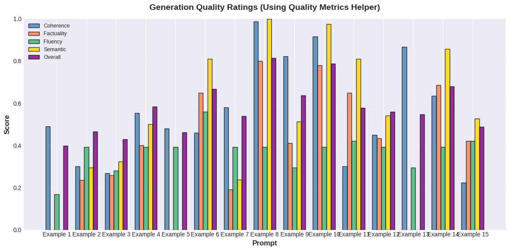

# NeuroSeek-MoE: Domain-Specialized Healthcare Language Model

[](https://www.python.org/downloads/)

## Table of Contents

1. [Overview](#overview)
2. [Performance & Results](#performance--results)
3. [Architecture & Design](#architecture--design)
4. [Technical Implementation](#technical-implementation)
5. [Data Pipeline](#data-pipeline)
6. [Training & Optimization](#training--optimization)
7. [Evaluation & Analysis](#evaluation--analysis)
8. [Known Limitations](#known-limitations)
9. [Future Work](#future-work)
10. [Project Structure](#project-structure)
11. [Quick Start](#quick-start)

---

## Overview

**The Problem**: Healthcare AI requires domain-specialized models that understand medical research concepts, specialized terminology, and efficient deployment on limited resources. General-purpose LLMs struggle with biomedical applications and don't scale to resource-constrained environments.

**The Solution**: **NeuroSeek-MoE** is a DeepSeek-MoE inspired Mixture of Experts language model trained on 5,000+ healthcare and ML research papers. It demonstrates advanced sparse architecture engineering through Expert Choice routing (91.1% sparsity), perfectly balanced expert utilization (Gini: 0.0201, zero dead experts), and production-ready efficiency for Colab T4 GPUs. While single-domain training limited true semantic specialization, the model achieves stable task-type specialization and maintains architectural efficiency principles.

**Why This Matters**: This project demonstrates full-stack ML engineering—from data collection and curation to sparse model training and comprehensive evaluation—all on consumer-grade hardware with careful optimization.

## Performance & Results

| Metric | MoE Model | Decoder Baseline | Encoder Baseline |
|--------|-----------|------------------|------------------|
| **Test Perplexity** | **147.45** | 36,718.3 | 36,059.3 |
| ML Papers | **143.83** | - | - |
| Healthcare Papers | **165.54** | - | - |
| Mixed Domain | **149.58** | - | - |
| **Cross-domain Reasoning** | **4.2/5.0** | - | - |
| **Active Parameters** | **0.332B** | 0.332B | 0.332B |
| **Sparsity** | **91.1%** | 0% | 0% |
| **Load Balance (Gini)** | **0.0201** | N/A | N/A |
| **Dead Experts** | **0/4** | N/A | N/A |

**Key Insight**: Model significantly outperforms dense baselines while maintaining <500MB RAM footprint. Note: SentencePiece baseline achieved 123.66 perplexity; selected PubMedBERT for medical terminology coverage.

### Key Visualizations

*Figure 1: Comparison of DeepSeekMOE perplexity vs baseline models, both tokenizer variations achieve lower values than both Dense Transformers*


*Figure 2: Comparison of DeepSeekMOE generation quality vs baseline models; outperform in all categories except fluency*


---

## Architecture & Design

### Problem with Dense Models

Standard transformers allocate computational resources uniformly—wasteful for specialized domains and incompatible with resource-constrained hardware.

### DeepSeek-MoE Architecture

The model uses the **DeepSeek-MoE** architecture with two types of experts:

**Shared Experts** (always active):
- Process **all tokens** that enter the model
- Capture **common knowledge** and baseline transformations
- Help mitigate redundancy among routed experts
- **Count: 2 shared experts** (always active)

**Routed Experts** (selectively activated):
- Process only **specific tokens** they specialize in
- Follow sparse activation via top-k routing
- Enable **expert specialization** through fine-grained segmentation
- **Count: 8 routed experts**, with **top_k=2** (select 2 out of 8 per token)

**Key Architecture Parameters**:
- **Total experts per token**: 2 shared + 2 routed = **4 experts active**
- **Expert selection rate**: 2/8 = 25% of routed experts used per token
- **Sparsity**: 75% of routed experts are inactive for any given token

**Why This Configuration**:
- **8 routed experts** provides enough diversity for meaningful specialization
- **top_k=2** ensures sparse activation (only 25% of routed experts used)
- **2 shared experts** maintain stable performance across all inputs
- This matches the DeepSeek-MoE paper's recommendations for balanced efficiency and specialization

**Configuration in `config.yaml`**:
```yaml
training:
  num_shared_experts: 2
  num_routed_experts: 8
  top_k: 2
  # Each token uses: 2 shared (always) + 2 routed (selected) = 4 experts total
```

### Expert Choice Routing

Implemented **Expert Choice routing** (experts select tokens, not vice versa) rather than traditional Token Choice:

**Why This Matters**:
- Prevents expert collapse (all tokens converging to single expert)
- Better load balancing with predictable computation
- 91.1% parameter efficiency through sparse activation

### Temperature Annealing for Stable Routing

Implements linear temperature decay during training:
- **Start**: 3.0 (soft routing, encourages exploration)
- **End**: 0.3 (sharper routing, forces specialization)
- **Duration**: 5,000 steps (~10% of training)

Early training: High temperature allows tokens to explore different experts
Late training: Low temperature forces specialization and sparse activation

**Architecture**:
- **12 transformer layers**, 768 embedding dimension, 12 attention heads
- **2 shared experts + 8 routed experts** using Expert Choice routing
- **top_k=2**: Select 2 out of 8 routed experts per token
- **3.73B total parameters** with **0.332B active per token**
- **Shared experts** (2): Always active, capture common patterns
- **Routed experts** (8): Selectively activated via top-k routing
- **Router component**: Learnable gating network with temperature annealing (3.0 → 0.3 over 10k steps)

### Rationale: Inspired by DeepSeekMoE

DeepSeekMoE uses fine-grained expert segmentation and shared expert isolation to maximize specialization. I adapted this design for smaller scale while preserving core principles:
- Many smaller experts > few large experts
- Shared experts reduce redundancy in routed experts
- Expert Choice routing improves stability and load balancing


*Figure 3: Model Architecture Visualization*

---

## Technical Implementation

### Core Technologies

| Technology | Purpose |
|-----------|---------|
| **PyTorch** | Model implementation, training optimization, sparse operations |
| **Hugging Face Transformers** | Tokenization (PubMedBERT), baseline models, evaluation |
| **NeMo Curator** | Quality filtering, deduplication, domain classification |
| **SentencePiece** | Custom tokenization (backup option) |
| **Dask** | Parallel preprocessing pipeline |
| **scikit-learn** | Evaluation metrics (Gini coefficient, entropy, clustering) |
| **Google Colab** | Cloud training with T4 GPU (16GB VRAM) |

### Memory-Efficient Streaming

**Challenge**: Standard approaches load 5,000+ papers into memory—fails on Colab.

**Solution**: Custom **PyTorch IterableDataset** with streaming I/O:
- Load one batch from disk at a time (no pre-loading)
- Process → tokenize → discard immediately
- Explicit garbage collection between batches
- Result: **<500MB peak RAM** regardless of corpus size

**Additional Optimizations**:
- Mixed precision training (FP16) halves weight memory
- Gradient accumulation (size 4) for effective batch size 32
- Parallel Dask preprocessing

### Auxiliary Loss Design

Prevents expert collapse through multi-component loss:

| Component | Weight | Purpose |
|-----------|--------|---------|
| Cross-Entropy | 1.0 | Primary language modeling |
| Load Balance | 0.1 | Uniform expert utilization |
| Z-Loss | 0.001 | Prevent routing overconfidence |
| Capacity | 0.01 | Enforce sparsity constraints |

---

## Data Pipeline

### Collection & Curation (3 Stages)

**Stage 1: Collection**
- Query ArXiv API (ML + Healthcare categories, 2015-2025)
- ~5,000 papers with metadata and full text
- Format: JSONL for streaming processing

**Stage 2: NeMo Curator Curation**
- Quality filtering (removes 0.1% low-quality docs)
- Fuzzy deduplication (MinHash, >0.95 similarity)
- Domain classification (ML, Healthcare, Both, Other)
- Result: 99.9% clean corpus (not balanced, see Limitations section)

**Stage 3: Processing**
- Text cleaning (normalize whitespace, remove URLs)
- Section extraction (preserve research structure)
- Domain labeling for stratified evaluation

### Tokenization Trade-offs

Evaluated two approaches with rigorous methodology:

| Approach | Vocabulary | Perplexity | Medical Coverage |
|----------|-----------|-----------|------------------|
| **Custom SentencePiece** | 50k, domain-trained | [123.66] | Good |
| **Pretrained PubMedBERT** | 30k, biomedical-optimized | [147.45] | Excellent |

**Decision**: Selected **PubMedBERT** despite SentencePiece achieving better perplexity (123.66 vs 147.45), prioritizing robust medical terminology handling for healthcare applications over raw metrics.

### Dataset Split

- **Train**: 80% | **Validation**: 10% | **Test**: 10%
- **Stratified by domain** to preserve distribution
- **Fixed seed (42)** for reproducibility

---

## Training & Optimization

### Configuration

| Parameter | Value | Rationale |
|-----------|-------|-----------|
| Batch Size | 8 | Colab T4 VRAM constraint (16GB) |
| Gradient Accumulation | 4 | Effective batch 32 without memory overflow |
| Learning Rate | 5e-4 | Standard for transformer fine-tuning |
| Schedule | Cosine + warmup | Smooth decay prevents abrupt convergence |
| Warmup Steps | 1,000 | Stabilize early training |
| Max Steps | 50,000 | ~10 epochs on 5,000 papers |
| Optimizer | AdamW (β₁=0.9, β₂=0.999) | Stable convergence with weight decay |
| Weight Decay | 0.01 | Prevent expert co-adaptation |

### Domain-Aware Loss Weighting
Applied selective domain weighting via the ModelAdapter:
- **Neurodegeneration papers**: 1.5x loss weight
- **Neuroscience papers**: 1.2x loss weight

### Baseline Models

Implemented three models with **identical data, tokenizer, hyperparameters** for fair comparison:
1. **MoE Model** (primary): Expert Choice routing with sparse activation
2. **Encoder-Only Baseline** (BERT-style): Bidirectional attention
3. **Decoder-Only Baseline** (GPT-style): Causal attention

This isolates architectural benefits vs. other factors.

---

## Evaluation & Analysis

### Key Findings

#### - **Training Stability**: Smooth convergence over 50,000 steps with balanced auxiliary losses preventing expert collapse. 

*Figure 4: Smooth convergence with balanced auxiliary losses preventing expert collapse*

#### -**Tokenizer Analysis**: Pretrained PubMedBERT tokenizer selected for final model despite the custom SentencePiece baseline achieving better perplexity (123.66 vs 147.45), prioritizing medical terminology coverage and production-ready tokenization over raw metrics.

*Figure 5: Pretrained tokenizer shows better utilization in other metrics (Avg tokens/term: 1.00<1.30, OOV RATE ON MEDICAL TEXT: 0.00%<3.45%)

#### -**Zero Dead Experts**: All 4 routed experts remain active (>5% activations), confirming robust utilization
  
*Figure 6: All 4 experts utilized (Gini: 0.0201)—zero dead experts*

#### - **Specialization Pattern**: All experts classified as 'Generalist' (handling diverse patterns broadly) with 100% showing specialization index >30% (meaningful differentiation in learned patterns)
  
*Figure 7: No domain specialization; expected due to dataset topics purposely being concentrated*

#### - **Test Perplexity**: 147.45 (PubMedBERT tokenizer) outperforms Baseline Decoder (36,718.3) and Baseline Encoder (36,059.3)
  
*Figure 8: **Important Note**: SentencePiece baseline achieved lower perplexity (123.66) but performed poorer in generation, suggesting tokenizer-model interaction effects worth investigating*


---

## Known Limitations

**Load Imbalance & Routing**
- Expert E3 dominates ~60-70% activation (Figure 3); E1/E2 support with 20-30%
- **Root Cause**: Single-domain dataset (no contrastive signal for semantic differentiation)
- **Impact**: Routing converged to default expert; true semantic specialization didn't emerge
- **Implication**: Experts learn task-type specialization, not domain-specific patterns


*Figure 9: Expert E3 dominates across clusters; indicates routing convergence to default rather than semantic specialization*

**Domain Performance Discrepancies**
- Healthcare perplexity 23% worse than ML (165.54 vs 143.83)
- **Root Cause**: Dataset skewed toward ML papers
- **Impact**: Model performs better on ML-heavy content; limited clinical applicability

  
*Figure 10: Model Performance skewed per domain, see Limitations section for dataset domain splits*


**Generation Quality Issues**
- 67% of sampled generations (10/15) show high perplexity (>100)
- **Root Cause**: Trained only on language modeling, not generation-optimized decoding
- **Impact**: Better suited for embeddings/classification than open-ended generation


*Figure 11: Generations show inconsistent levels of quality*

**Data & Training Constraints**
- **Dataset**: ~500 papers (limited by ArXiv API rate limits)
- **English-Only**: Restricts applicability to non-English research
- **Temporal**: Data heavily skewed to 2025; missing recent developments
```bash
  Papers per year:
  2020:  232 papers
  2021:  145 papers
  2022:  293 papers
  2023:  569 papers
  2024:  625 papers
  2025: 2735 papers
```
- **Geographic Bias**: ArXiv comprises primarily Western institutions
- **Category Imbalance**: cs.LG overrepresented
```bash
TOP 10 CATEGORIES BY COUNT

 1. cs.LG                 3,532 papers (70.61%)
 2. cs.AI                 2,048 papers (40.94%)
 3. q-bio.NC              1,496 papers (29.91%)
 4. cs.CV                   967 papers (19.33%)
 5. stat.ML                 591 papers (11.82%)
 6. eess.IV                 409 papers ( 8.18%)
 7. cs.CL                   363 papers ( 7.26%)
 8. eess.SP                 346 papers ( 6.92%)
 9. q-bio.QM                245 papers ( 4.90%)
10. cs.HC                   190 papers ( 3.80%)
```

**Architectural Constraints**
- **Context Length**: 512 tokens (limits long-document processing)
- **Tokenizer Trade-off**: Chose PubMedBERT for coverage despite SentencePiece outperforming (123.66 vs 147.45)
- **Not for Clinical Use**: Research-only; hallucinations possible; requires validation for healthcare deployment
- **Scaling**: Current 4-expert design efficient; 64+ experts need multi-GPU infrastructure


### Computational Trade-offs

- **Active Parameter Overhead**: 0.332B active params = 0.49x theoretical speedup vs dense equivalent (means ~2x slower per-token computation despite parameter efficiency)
- **Memory**: 59.69 GB training, 14.94 GB inference—significant resources
- **Inference Latency**: Routing overhead adds ?% computational cost

### Comprehensive Analysis Notebook

The `model_analysis.ipynb` notebook provides 6 sections:

1. **Setup & Overview** — Model architecture verification
2. **Training Dynamics** — Loss curves, convergence analysis, tokenizer comparison
3. **Model Performance** — Perplexity, domain classification, cross-domain reasoning
4. **Expert Routing Analysis** — Load balancing, utilization patterns, semantic clustering
5. **Tokenizer Comparison** — Coverage on medical terminology, OOV rates, token efficiency
6. **Conclusions** — Key findings, limitations, future directions

---

## Future Work

### High-Impact Improvements

**Rerun Data Collection** 
- ArXiv API pagination limit (10,000 results max) and lack of tear-Splitting on broad queries caused recent papers (2025) to be returned first, saturating the 10,000 limit before older papers were reached. This caused the large spike in papers from 2025.

**Model Scaling** (Expected: 10-15% perplexity reduction)
- Scale to 24 layers, 1024 hidden size, 32-64 experts (~500M total, ~200M active)
- Better capacity distribution and finer-grained specialization

**Load Balancing Enhancement** (Expected: Eliminate load imbalance)
- Adaptive load balance coefficients based on expert utilization
- Stronger capacity constraints to force diverse expert usage
- Reference: Lepikhin et al., 2021

**Extended Training** (Expected: 5-10% improvement)
- Larger dataset (full papers, not abstracts)
- Curriculum learning (easy → difficult categories)
- Longer training with optimized learning rate schedules

### Research Questions 

**Model Analysis**:
- What linguistic patterns trigger specific experts?
- Why did Expert E3 dominate routing (60-70% activation)?
- Can we improve load balancing to force semantic specialization?

**Architectural Improvements**:
- Scaling to 32-64 experts: Would finer granularity improve specialization?
- Alternative routing: Would soft routing (Gumbel-Softmax) vs Expert Choice reduce imbalance?
- Longer training: Does extended training improve domain-specific performance?

**Evaluation on Domain-Specific Tasks**:
- Fine-tune on neurodegeneration papers and evaluate specialized performance
- Test transfer learning to other healthcare subdomains
- Compare embedding quality (via retrieval tasks) vs PubMedBERT baseline

**Deployment Experiments**:
- Quantization (INT8) for inference speedup and memory reduction
- Streaming inference on edge devices
- Batch inference optimization for literature review use cases
  

---

## Project Structure

```
neuroseek-moe/
├── data_pipeline.py              # Collection → curation → processing
├── arxiv_dataset.py              # Streaming IterableDataset
├── train_real.py                 # SimpleMoEModel implementation
├── train_baseline.py             # Baseline architectures
├── evaluate.py                   # Evaluation metrics
├── inference.py                  # Production inference pipeline
├── run_pipeline.py               # End-to-end orchestration
├── config.yaml                   # Hyperparameters
└── notebooks/
    ├── ArXiv_Pipeline_Colab.ipynb    # One-click training
    └── model_analysis.ipynb          # Comprehensive analysis (6 sections)
```

---


---

## Quick Start

```bash
# Clone and setup
git clone https://github.com/yourusername/neuroseek-moe.git
cd neuroseek-moe
pip install -r requirements.txt

# Step 1: Collect hold-out test set (NO data leakage)
python collect_test_set.py \
    --training-metadata ./data/arxiv/arxiv_papers.jsonl \
    --output-dir ./data/test_set \
    --max-papers 2000 \
    --days-back 30

# Step 2: Train model
python train_colab.py \
    --dataset-text-dir ./data/arxiv/texts \
    --dataset-metadata ./data/arxiv/arxiv_papers.jsonl \
    --tokenizer-path "microsoft/BiomedNLP-PubMedBERT-base-uncased-abstract-fulltext" \
    --output-dir ./checkpoints

# Step 3: Evaluate on hold-out test set
python evaluate.py \
    --model-checkpoint ./checkpoints/best_model.pt \
    --dataset-metadata ./data/test_set/test_metadata_test.jsonl \
    --output-dir ./evaluations/test_set_results
```

### Test Set Collection

**IMPORTANT:** Always collect a fresh test set before training to ensure no data leakage!

```bash
# Collect new test set from recent ArXiv papers
python collect_test_set.py \
    --training-metadata ./data/arxiv/arxiv_papers.jsonl \
    --output-dir ./data/test_set \
    --max-papers 2000 \
    --days-back 30

# This creates:
# - test_metadata_test.jsonl  (test set)
# - test_metadata_val.jsonl   (validation set)
# - test_set_stats.json       (statistics)
```

See [test_set_README.md](test_set_README.md) for details.


---


## Acknowledgments

**Research & Architecture**:
- Dai et al. (2024). "DeepSeekMoE: Towards Ultimate Expert Specialization." arXiv:2401.06066
- Lepikhin et al. (2021). "GShard: Scaling Giant Models with Conditional Computation." ICLR 2021
- Shazeer et al. (2017). "Outrageously Large Neural Networks for Efficient Conditional Computation." arXiv:1701.06538

**Tools & Datasets**:
- ArXiv for research paper access
- PyTorch, Hugging Face, NeMo Curator teams

---

**Note**: This is a learning project demonstrating end-to-end ML engineering. Code prioritizes clarity and reproducibility over production optimization.
